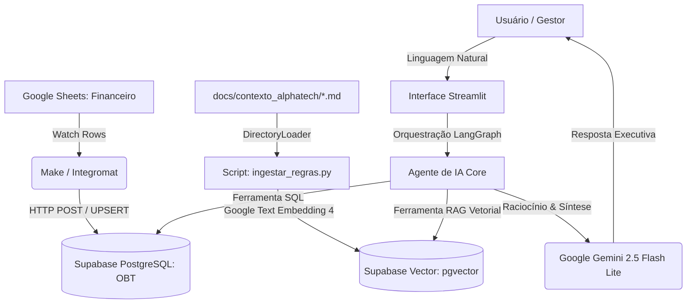

# 🤖 Agente de IA AlphaTech (Sebrae)

Este repositório contém a solução corporativa (*Enterprise*) do **Agente de IA AlphaTech**, desenvolvida em parceria estratégica com o Sebrae. O sistema é uma plataforma de Inteligência Artificial Generativa baseada em nuvem, projetada para orquestrar dados quantitativos (financeiros) e qualitativos (diretrizes de conformidade e regras de negócio) de forma unificada.

A solução utiliza uma arquitetura *Stateless* de **RAG Híbrido (Retrieval-Augmented Generation)**, eliminando dependências de armazenamento local e garantindo alta escalabilidade através do ecossistema Google Gemini e Supabase.

---

## 🗺️ Visão Geral da Arquitetura

O ecossistema divide-se em um pipeline automatizado de ingestão contínua (ETL assíncrono) e uma camada de consumo inteligente via Agente de IA Orquestrador:



---

## ✨ Principais Funcionalidades

1. **Pipeline ETL Automatizado (No-Code/Pro-Code):** Monitoramento em tempo real das planilhas financeiras do Google Sheets através do Make (Integromat), consolidando dados de Receitas, Custos e Metas de forma assíncrona no banco através de operações de `UPSERT`.
2. **Text-to-SQL com Padrão OBT (One Big Table):** Estrutura tabular financeira desnormalizada em nuvem que reduz drasticamente alucinações matemáticas da IA e economiza *tokens* de contexto.
3. **RAG Vetorial Nativo (`pgvector`):** Varredura inteligente de múltiplos arquivos de contexto em formato Markdown (`.md`), convertidos em vetores de 768 dimensões com o modelo `text-embedding-004` e armazenados no Supabase.
4. **Orquestração por Grafos de Estado:** Implementação com **LangGraph** para garantir o roteamento determinístico e seguro das ferramentas (*Tool Calling*), escolhendo a melhor base de dados (relacional ou vetorial) conforme a intenção do usuário.

---

## 📂 Estrutura do Repositório

```text
Agente-IA-AlphaTech-Sebrae/
├── docs/
│   └── contexto_alphatech/       # Arquivos qualitativos de governança (.md)
│       ├── dicionario_dados.md
│       ├── metas_empresa.md
│       └── regras_negocio.md
├── src/
│   ├── app.py                     # Interface do Usuário (Streamlit)
│   ├── agente.py                  # Orquestração do Grafo e LLM (LangGraph)
│   ├── ferramentas.py             # Definição das Ferramentas (SQL e RAG Supabase)
│   └── ingestar_regras.py         # Script de Ingestão de Embeddings para Nuvem
├── .env.example                   # Modelo de variáveis de ambiente
├── DECLARACAO_AUTORIA.md          # Declaração oficial de autoria e ferramentas
├── requirements.txt               # Lista de dependências do Python
└── README.md                      # Documentação principal do repositório
```

---

## 🚀 Pré-requisitos e Instalação

### 1. Clonar o Repositório
```bash
git clone https://github.com/GSimas/Agente-IA-AlphaTech-Sebrae-.git
cd Agente-IA-AlphaTech-Sebrae-
```

### 2. Configurar o Ambiente Virtual (Python 3.11 ou 3.12 Recomendados)
Para evitar conflitos com pacotes matemáticos de baixo nível, evite versões experimentais (como o Python 3.14).
```bash
python3 -m venv venv
source venv/bin/activate
```

### 3. Instalar Dependências Unificadas
```bash
./venv/bin/pip install --upgrade pip
./venv/bin/pip install langchain langchain-core langchain-community langchain-google-genai langgraph supabase python-dotenv streamlit pandas plotly
```

### 4. Configurar as Variáveis de Ambiente
Crie um arquivo `.env` na raiz do projeto com base no modelo abaixo:
```env
GOOGLE_API_KEY="AIzaSy..."
SUPABASE_URL="https://seu-projeto.supabase.co"
SUPABASE_KEY="eyJhbGciOi..." # Utilize a service_role para bypass de RLS no backend
```

---

## 🛠️ Inicialização do Sistema

### Passo 1: Preparar o Banco no Supabase (SQL Editor)
Execute os scripts SQL necessários contidos na documentação para criar a tabela de fechamento financeiro (`resumo_financeiro_enriquecido`), a tabela de vetores (`documents`) e a função remota de similaridade por cosseno (`match_documents`).

### Passo 2: Executar a Ingestão Vetorial das Regras
Suba os dados qualitativos da pasta `docs/` para a nuvem rodando o script de preparação:
```bash
./venv/bin/python src/ingestar_regras.py
```

### Passo 3: Executar a Interface do Painel (Streamlit)
Inicie o chatbot orquestrador utilizando o binário Python exclusivo do ambiente virtual:
```bash
./venv/bin/python -m streamlit run src/app.py
```

---

## 🛡️ Segurança, Governança e Limitações

* **Row-Level Security (RLS):** As tabelas no Supabase são isoladas por políticas estritas de acesso. A integração do Make e os scripts de ingestão utilizam autenticação baseada em chaves do tipo `service_role` (Server-to-Server Authentication).
* **Isolamento de Credenciais:** Nenhuma chave de API ou credencial corporativa está gravada rigidamente no código source. O controle é feito de forma exclusiva através de variáveis de ambiente injetadas via `python-dotenv`.
* **Granularidade:** O modelo de dados atual opera em nível de agregação mensal por Unidade de Negócio. O agente está configurado para responder sobre relatórios executivos e metas estruturadas, omitindo dados de nível transacional (como notas fiscais individuais) para preservar a integridade da governança.

---

## 📄 Licença e Autoria

Este projeto foi desenvolvido por **Gustavo Simas da Silva** (Engenheiro do Conhecimento). Para detalhes completos sobre as IAs auxiliadoras e sub-bibliotecas empregadas na homologação deste sistema, consulte o arquivo [DECLARACAO_AUTORIA.md](./DECLARACAO_AUTORIA.md).